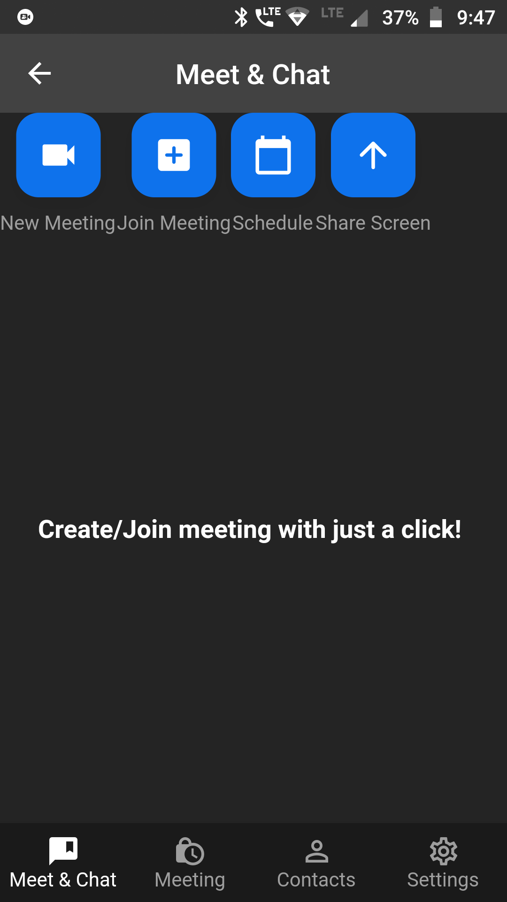
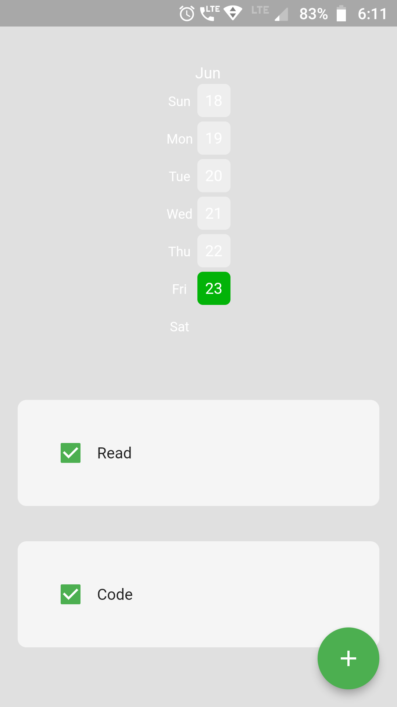
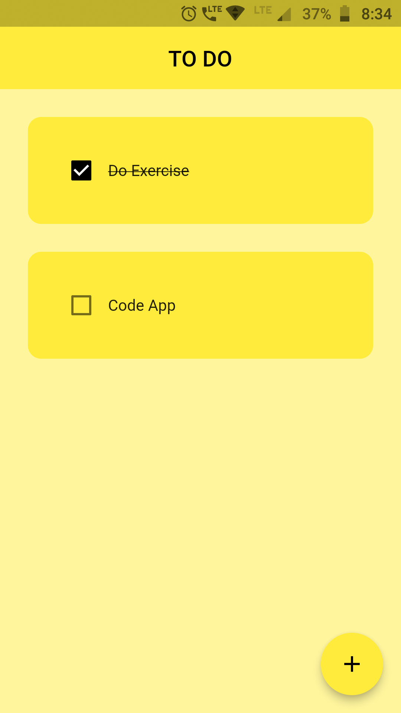
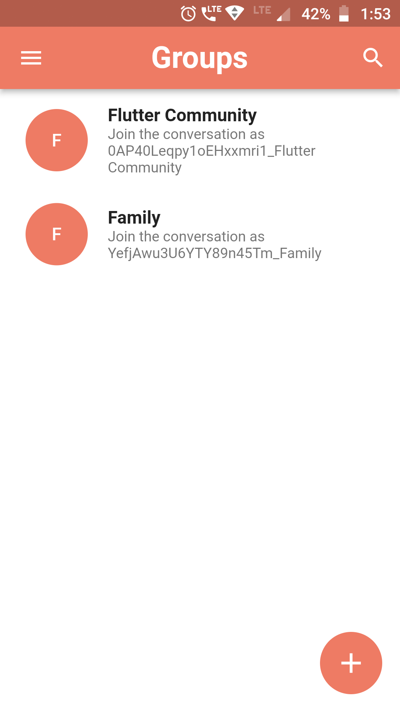

# Kotlin Portfolio

## [Project 1: Instagram Clone](https://github.com/itsmohsin/InstagramClone) 

## [Project 2: 🌦⛈ Kotlin Weather App](https://github.com/itsmohsin/kotlin_WeatherApp) 

# Flutter Portfolio

## [Project 1: 🌦⛈ Weather App](https://github.com/itsmohsin/weather_app) 

## [Project 2:  📞🎥 Zoom Clone](https://github.com/itsmohsin/zoom_clone) 

## [Project 3: 🚴🏽‍♂️🏃‍♂ Habit Tracker App](https://github.com/itsmohsin/habit_tracker)

## [Project 4: 🚴🏽‍♂️🏃‍♂ ToDo List App](https://github.com/itsmohsin/habit_tracker)

## [Project 5: 💬💭 Chat App](https://github.com/itsmohsin/chatapp_firebase)

## [Project 6: 🗣️ Voice Assistant App](https://github.com/itsmohsin/chatapp_firebase)

